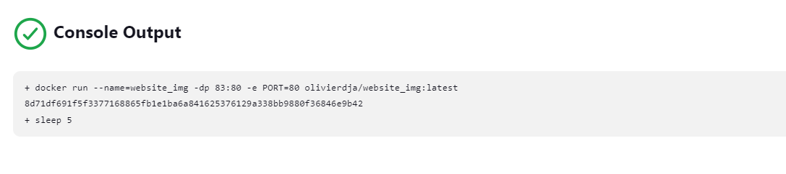
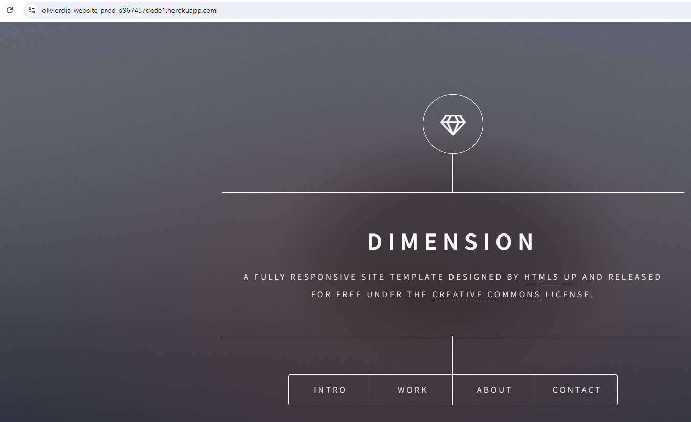

## Firstname : Olivier

## Surname : Djatchue-Tchokothe

## For Eazytraining's 18th DevOps Bootcamp

## Period : march-april-may

# Nginx Website Deployment with Jenkins Pipeline

This project demonstrates a Jenkins pipeline for deploying an Nginx website to Heroku. The pipeline is triggered by a GitHub webhook on every push to the repository. Below is a detailed explanation of each step in the pipeline.

## Table of Contents

1.  [Prerequisites](#prerequisites)
2.  [Project Setup](#project-setup)
3.  [Jenkins Pipeline Configuration](#jenkins-pipeline-configuration)
4.  [Step-by-Step Pipeline Explanation](#step-by-step-pipeline-explanation)
    1.  [Build Docker Image](#1-build-docker-image)
    2.  [Clean Up Existing Containers](#2-clean-up-existing-containers)
    3.  [Launch Docker Container](#3-launch-docker-container)
    4.  [Run Tests](#4-run-tests)
    5.  [Upload Image to DockerHub](#5-upload-image-to-dockerhub)
    6.  [Deploy to Heroku Staging](#6-deploy-to-heroku-staging)
    7.  [Deploy to Heroku Production](#7-deploy-to-heroku-production)
5.  [Screenshots](#screenshots)
6.  [Conclusion](#conclusion)
7.  [Lessons Learned](#lessons-learned)

## Prerequisites

-   Jenkins installed and configured
-   Docker installed on the Jenkins server
-   GitHub repository for your project
-   DockerHub account
-   Heroku account

## Project Setup

1.  **Dockerfile**: Ensure you have a `Dockerfile` for building your Nginx website image.
2.  **Jenkinsfile**: Create a `Jenkinsfile` in your GitHub repository with the pipeline script.
3.  **GitHub Webhook**: Configure a webhook in your GitHub repository to trigger the Jenkins pipeline on every push.

## Jenkins Pipeline Configuration

Create a new pipeline job in Jenkins and link it to your GitHub repository. Ensure Jenkins has access to Docker, DockerHub, and Heroku CLI.

## Step-by-Step Pipeline Explanation

### 1. Build Docker Image

This step uses the `Dockerfile` in your repository to build a Docker image of your Nginx website.

```bash
stages{
        stage('Build Docker Image'){
            agent any
            steps{
                script {
                    sh 'docker build -t olivierdja/$INAGE_NAME:$INAGE_TAG .' 
                }
            }
        }
```

### 2. Clean Up Existing Containers

Before launching a new container, the pipeline checks for and removes any existing containers from previous runs.

```bash
 stage('Clean Up Existing Containers'){
            agent any
            steps{
                script {
                    sh '''
                    docker rm -f $INAGE_NAME || echo "Container does not exist"
                    
                    '''
                }
            }
        }
```

### 3. Launch Docker Container

The built Docker image is used to start a new container.

```bash
 stage('Launch Docker Container'){
            agent any
            steps{
                script {
                    '''bash
                    docker run --name=$INAGE_NAME -dp 83:80 -e PORT=80 olivierdja/$INAGE_NAME:$INAGE_TAG
                    sleep 5
                    
                    '''
                }
            }
        }
```
    
### 4. Run Tests

A test is performed to ensure the website is working correctly by using `curl` and `grep`.

```bash
        stage('Run Tests'){
            agent any
            steps{
                script {
                    sh '''
                    curl $ENDPOINT:83 | grep "Dimension"
                    
                    '''
                }
            }
        }
```
### 5. Upload Image to DockerHub

If the tests pass, the Docker image is uploaded to DockerHub.
```bash
  stage('Upload Image to DockerHub'){
            agent any
            steps{
                script {
                    sh '''
                    echo $DOCKERHUB_CREDENTIALS_PSW | docker login -u $DOCKERHUB_CREDENTIALS_USR --password-stdin
                    docker push  olivierdja/$INAGE_NAME:latest
            
                    '''
                }
            }
        }
```

### 6. Deploy to Heroku Staging

Deploy the Docker image to a Heroku staging environment.
```bash
   stage('Deploy to Heroku Staging'){
            when{
                expression { GIT_BRANCH == 'origin/master'}
            }
            agent any
            environment{
                HEROKU_API_KEY = credentials('heroku_api_key')
            }
            steps{
                script {
                    sh '''
                    npm i -g heroku@7.68.0
                    heroku container:login
                    heroku create $STAGING || echo "project already exist"
                    heroku container:push -a $STAGING web
                    heroku container:release -a $STAGING web
                    
                    '''
                }
            }
        }
```
        
### 7. Deploy to Heroku Production

After verifying the staging deployment, the image is then deployed to the production environment.
```bash
   stage('Deploy to Heroku Production'){
            when{
                expression { GIT_BRANCH == 'origin/master'}
            }
            agent any
            environment{
                HEROKU_API_KEY = credentials('heroku_api_key')
            }
            steps{
                script {
                    sh '''
                  npm i -g heroku@7.68.0
                  heroku container:login
                  heroku create $PRODUCTION || echo "project already exist"
                  heroku container:push -a $PRODUCTION web
                  heroku container:release -a $PRODUCTION web
                    
                    '''
                }
           
```
## Screenshots  
1.  **Jenkins Pipeline Steps**: Screenshots of each step in the Jenkins pipeline.
    - Overview
>
    -   Build Docker Image
>
    -   Clean Up Existing Containers
>
    -   Launch Docker Container
>
    -   Run Tests
>
    -   Upload Image to DockerHub
>
    -   Deploy to Heroku Staging
>
    -   Deploy to Heroku Production
>

1.  **Opening the App**: Open the app in the browser.
>

1.  **Opening the App**: Open The app with the Heroku Url.
>


## Conclusion

This project showcases the automation of deploying an Nginx website to Heroku using Jenkins. By leveraging Docker for containerization, Jenkins for continuous integration and continuous deployment (CI/CD), and Heroku for application hosting, we achieved a streamlined and efficient deployment pipeline. This setup ensures that any code changes pushed to the GitHub repository are automatically tested and deployed, minimizing manual intervention and reducing the risk of errors.

## Lessons Learned

During this project, I learned:

-   **Pipeline Automation**: How to create and configure a Jenkins pipeline to automate the build, test, and deployment process.
-   **Containerization**: The importance of Docker in packaging applications and its role in consistent deployment environments.
-   **Continuous Integration and Continuous Deployment (CI/CD)**: The benefits of implementing CI/CD practices to ensure rapid and reliable delivery of software.
-   **Heroku Deployment**: How to deploy Docker containers to Heroku, including the staging and production environments.
-   **Problem-Solving**: Troubleshooting various issues that arose during the configuration and execution of the pipeline, enhancing my debugging skills.

This project has not only enhanced my technical skills but also emphasized the importance of automation and modern development practices in achieving efficient and reliable software delivery.
